<a href="https://github.com/Ayan-x4">
<picture>
<source media="(prefers-color-scheme: dark)" srcset="./dark.svg">

</picture>
</a>

---

<h2 align="center">Hi 👋 I'm Muhammad Ayan</h2>

<h3 align="center">
MERN Stack Developer • Java Developer • Learning Agentic AI
</h3>

---

---

## 🚀 Tech Stack

---

## 📊 GitHub Stats

---

## 🏆 GitHub Trophy

---

## 📈 Contribution Graph

---

## 🐍 Contribution Snake

---

### ⭐ Thanks for visiting ⭐

